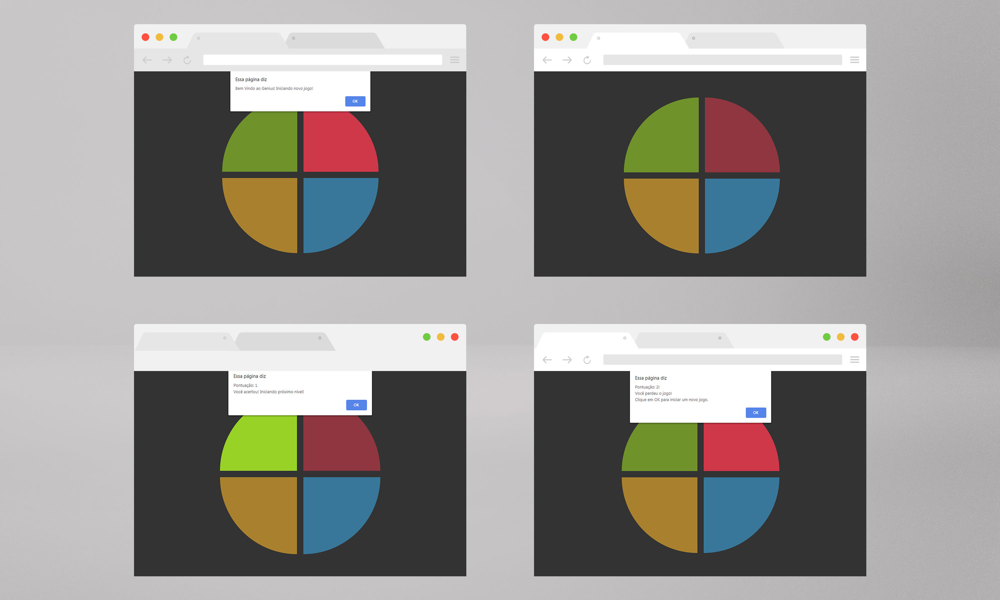

# Jogo da Memória estilo Genius
Projeto de jogo Genius utilizando apenas HTML, CSS e Javascript de forma indrodutória, sendo o principal conceito, CSS Grid, manipulação de Array e Arrow Functions. Acrescentei ao projeto sons.

<a href='https://br.freepik.com/fotos-vetores-gratis/maquete'>Maquete psd criado por CosmoStudio - br.freepik.com</a>
