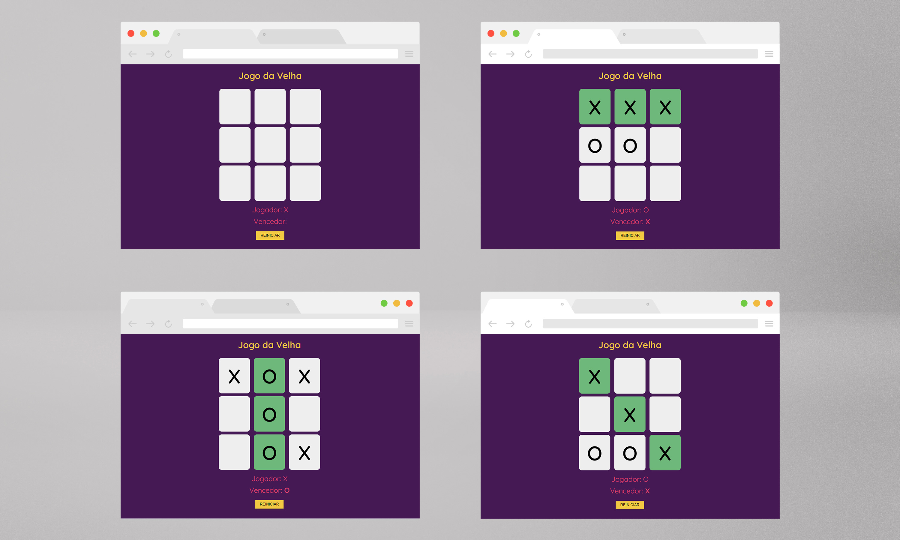

# Jogo da Velha
Projeto de um jogo da velha utilizando HTML, CSS e Javascript para criarmos toda suas interações, desde a escolha do jogador, efetivar a jogada e dar um vencedor ao jogo usando funções básicas e um pouco de lógica.

<a href='https://br.freepik.com/fotos-vetores-gratis/maquete'>Maquete psd criado por CosmoStudio - br.freepik.com</a>