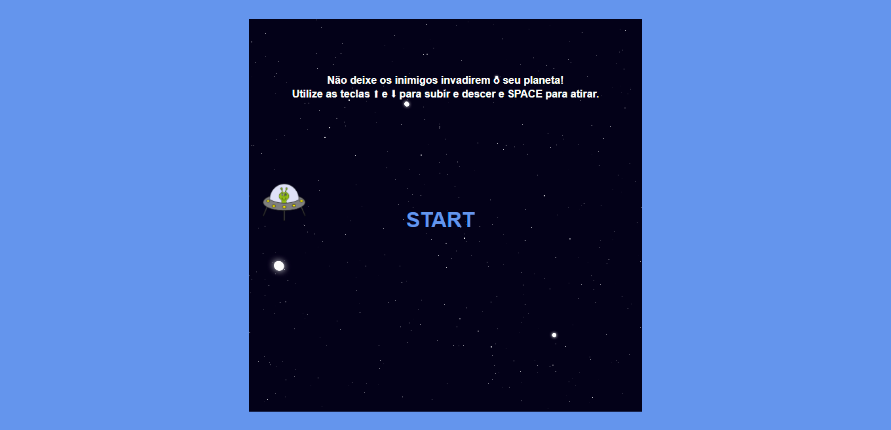
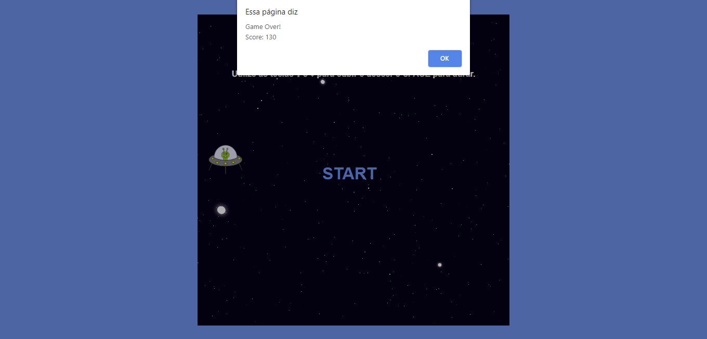

# Space Shooter Game
O projeto consiste em um jogo no estilo Space Shooter utilizando HTML, CSS e Javascript abordando posicionamento no CSS e lógica de programação utilizando posicionamento com CSS, manipulação do DOM, eventListeners, e manipulação de Array. Foi acrescentado o som do laser, uma soundtrack e pontuação final.

